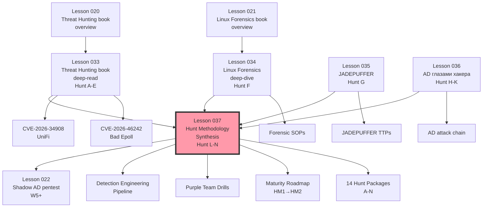

> **Источники (синтез):**
> 1. **`lesson-033-threat-hunting-book.md`** — Аль-Фардан «Охота за киберугрозами» (Неделя 3)
> 2. **`lesson-034-linux-forensics-deep-dive.md`** — Nikkel «Practical Linux Forensics» deep-dive
> 3. **`lesson-035-jadepuffer-ai-ransomware.md`** — JADEPUFFER first AI-driven ransomware (Sysdig, июль 2026)
> 4. **`lesson-036-ad-hacker-perspective.md`** — Active Directory attack chain (Kerberoast, AS-REP, DCSync, ACL)
> 5. **MITRE ATT&CK v15** + **MITRE ATLAS** + **MITRE D3FEND** (counter-techniques)
> 6. **NIST SP 800-61r3** (Incident Response Lifecycle, 2025)
> 7. **MITRE PRE-ATT&CK + Enterprise ATT&CK + Mobile ATT&CK** (full chain)
> 8. **SANS Threat Hunting Methodology** (Robert M. Lee, 2024 update)
> 9. **Sqrrl / Amazon Threat Hunting loop** (David Bianco's Pyramid of Pain, refined)
>
> **Дата конспекта:** 19.07.2026. **Автор:** Хранитель 📚 (synthesis lesson Недели 4).
> **Цель lesson-037:** объединить hunt-методологии из 4 предыдущих уроков в **одну операционную процедуру** отдела «Киберщит 🛡», применимую к реальным инцидентам. Устранить дублирование, нормализовать терминологию, определить **точки интеграции** и **конкретные SOPs** для каждой фазы hunt-loop.
> **Cross-refs:** `lesson-033` (§ 1–7), `lesson-034` (§ 1–9), `lesson-035` (§ 1–11), `lesson-036` (§ 1–11), `intel/techniques/threat-hunting-methodology-2026.md` (опубликованный artifact, в который формализуется этот lesson).

---

## TL;DR

**Lesson-037** — это **операционная методология**, которая превращает разрозненные знания из lessons 033–036 в **конкретный, повторяемый процесс** threat hunting'а для отдела «Киберщит 🛡». Вместо «куча Sigma rules и Python-скриптов» — **единый hunt-loop** с четкими входами/выходами для каждой фазы.

**Структура lesson-037:**

1. **§ 1 — Unified Hunt Loop (UHL)** — обновлённый hunt-цикл, объединяющий:
   - Hunt из lesson-033 (Al-Fardan hunt-loop + дополнения W3).
   - Forensic из lesson-034 (post-hunt evidence collection).
   - JADEPUFFER из lesson-035 (agentic AI detection priorities).
   - AD from lesson-036 (T1558/T1003/T1078 detection patterns).
2. **§ 2 — 5 Hunt Scenarios (Hunt A–G)** — операционные сценарии для нашей инфры, объединяющие все 4 источника.
3. **§ 3 — Detection Engineering Pipeline (DEP)** — как создавать Sigma/YARA/KQL правила системно (не ad-hoc).
4. **§ 4 — Purple Team Drills** — операционализированные тесты (Kerberoast, JADEPUFFER-style agent, CVE retrospective hunts).
5. **§ 5 — Maturity Roadmap** — куда двигаться от HM0 (Initial) к HM3 (Quantitatively Managed).
6. **§ 6 — Operational Playbooks** — конкретные runbooks для Hunt A–G (кто делает, что делает, в какое время).
7. **§ 7 — Knowledge Graph** — как уроки 033–037 связаны между собой и с остальной базой знаний.
8. **§ 8 — Action items W4–W6** — конкретные deliverables на ближайшие 2 недели.

**Главное нововведение lesson-037:** введение понятия **«Hunt Package»** — готового комплекта (1 Sigma rule + 1 YARA rule + 1 KQL query + 1 Python script + 1 baseline + 1 detection test) на каждый hunt-сценарий. Цель — **HM1 maturity level** через 2 недели.

**Принципы UHL (Unified Hunt Loop):**
1. **Intel-first** — hunt начинается с threat intel, не с alert.
2. **Baseline-required** — без baseline нет anomaly detection.
3. **Hypothesis-explicit** — каждая hypothesis сформулирована письменно, с pre-flight check.
4. **Multi-source corroboration** — single signal = noise, multi-source = signal.
5. **Post-hunt retrospective** — каждый hunt заканчивается «что нашли / не нашли / обновить baseline».
6. **Detection-as-Code** — правила версионируются в Git, тестируются через Atomic Red Team.
7. **Continuous validation** — drill не реже 1 раза в месяц.

**Практический артефакт:** `intel/techniques/threat-hunting-methodology-2026.md` (canonical reference) и `intel/forensic/jadepuffer-response-playbook.md` (incident response).

---

## § 1. Unified Hunt Loop (UHL)

### 1.1 Архитектура UHL

**Объединённый hunt-цикл** (синтез lesson-033 § 2.1 + lesson-034 § 11 + lesson-035 § 2 + lesson-036 § 5):

```
┌──────────────────────────────────────────────────────────────────┐
│                   UNIFIED HUNT LOOP (UHL)                        │
│                                                                  │
│   ┌──────────┐                                                   │
│   │  INTEL   │ ← threat reports, CVE feeds, MISP, OTX,           │
│   │  INPUT   │   dark web, vendor advisories                    │
│   └────┬─────┘                                                   │
│        │                                                         │
│        ▼                                                         │
│   ┌──────────┐                                                   │
│   │ BASELINE │ ← снимок нормального состояния                   │
│   │ ESTABL.  │   (network, processes, configs, users)           │
│   └────┬─────┘                                                   │
│        │                                                         │
│        ▼                                                         │
│   ┌──────────────┐                                               │
│   │  HYPOTHESIS  │ ← intel-driven, asset-driven,                 │
│   │  FORMULATION │   analytics-driven, compliance-driven        │
│   └────┬─────────┘                                               │
│        │                                                         │
│        ▼                                                         │
│   ┌──────────────┐                                               │
│   │  PRE-FLIGHT  │ ← какой сигнал подтвердит/опровергнет?       │
│   │    CHECK     │   какие данные нужны? сколько времени?        │
│   └────┬─────────┘                                               │
│        │                                                         │
│        ▼                                                         │
│   ┌──────────────┐                                               │
│   │  DATA        │ ← syslog, journal, nginx access,             │
│   │  COLLECTION  │   ETW, auditd, network flows, cloud audit    │
│   └────┬─────────┘                                               │
│        │                                                         │
│        ▼                                                         │
│   ┌──────────────┐                                               │
│   │  ANALYSIS    │ ← grep, Sigma rules, ML (isolation forest),  │
│   │              │   timeline analysis (plaso), correlation     │
│   └────┬─────────┘                                               │
│        │                                                         │
│        ▼                                                         │
│   ┌──────────────┐                                               │
│   │  CORROBOR.   │ ← multi-source: SIEM + EDR + log + netflow    │
│   │              │   single-source = noise, multi = signal       │
│   └────┬─────────┘                                               │
│        │                                                         │
│        ▼                                                         │
│   ┌──────────────┐                                               │
│   │  ACTION      │ ← isolate, contain, eradicate, recover,      │
│   │              │   document, communicate                      │
│   └────┬─────────┘                                               │
│        │                                                         │
│        ▼                                                         │
│   ┌──────────────┐                                               │
│   │  POST-HUNT   │ ← update baseline, write findings,           │
│   │  RETROSPECT. │   improve Sigma rules, schedule next hunt    │
│   └────┬─────────┘                                               │
│        │                                                         │
│        └────────────────► back to INTEL INPUT                   │
│                                                                  │
└──────────────────────────────────────────────────────────────────┘
```

### 1.2 Каждая фаза — конкретные артефакты

| Фаза UHL | Что делаем | Инструменты | Артефакты | Из lesson |
|---|---|---|---|---|
| **INTEL INPUT** | Мониторим threat feeds, читаем CVE digest | NVD, CISA KEV, OTX, MISP, digest-cron | `intel/digest/digest-YYYY-MM-DD.md`, `intel/cve/active/*.md` | lesson-033 § 2.4 |
| **BASELINE EST.** | Снимаем snapshot «нормального» состояния | `ss -tunp`, `auditctl`, `journalctl --vacuum-time`, `debsums`, `sha256sum` | `intel/baselines/<asset>-baseline.txt`, `intel/baselines/*.sha256` | lesson-034 § 1.2, 2.4, 6 |
| **HYPOTHESIS** | Формулируем hypothesis statement | Шаблон: «Если [TТP] на [asset], то [data source] покажет [signal]» | `intel/hunts/hunt-<id>-hypothesis.md` | lesson-033 § 2.1 |
| **PRE-FLIGHT** | Sanity-check: данные доступны? | Test query на малом объёме | Pre-flight log | lesson-033 § 2.1 |
| **DATA COLLECTION** | Собираем данные за окно hypothesis | ssh, scp, journalctl, auditd logs | `/tmp/hunt-<id>-data.tar.gz` | lesson-034 § 6 |
| **ANALYSIS** | Ищем сигнал, коррелируем | Sigma rules (Splunk/Elastic/Loki), Python (`hunt-*.py`), YARA | `intel/hunts/hunt-<id>-findings.json` | lesson-033 § 3, 5 |
| **CORROBORATION** | Cross-check с другими источниками | Network flow + auditd + auth log | Correlated evidence file | lesson-035 § 4 |
| **ACTION** | Containment + eradication | UF, firewall, account disable, patch | `intel/incidents/INC-<id>/response.md` | lesson-034 § 11 |
| **POST-HUNT RETRO** | Document, update, schedule | Markdown template | `agents/khranitel/reports/<date>-hunt-<id>-retro.md` | lesson-033 § 7 |

### 1.3 Где UHL расходится с классическим NIST IR Lifecycle

**NIST SP 800-61r3 (2025)** — incident response lifecycle:
```
Preparation → Detection & Analysis → Containment, Eradication, Recovery → Post-Incident Activity
```

**UHL (наша методология)** — расширяет NIST IR:
- **Preparation** = `BASELINE EST.` + `DETECTION ENGINEERING PIPELINE (DEP)`
- **Detection & Analysis** = `INTEL INPUT` → `HYPOTHESIS` → `PRE-FLIGHT` → `DATA COLLECTION` → `ANALYSIS` → `CORROBORATION`
- **Containment/Eradication/Recovery** = `ACTION` (с breakdown на contain/erad/recover)
- **Post-Incident Activity** = `POST-HUNT RETROSPECTIVE` + **Hunt Library Update**

**Ключевое дополнение UHL:** **continuous** (hunt не заканчивается на post-incident — каждое ретро приводит к новым hypothesis'ам и hunt'ам).

---

## § 2. Hunt Scenarios (Hunt A–G) — операционная библиотека

### 2.1 Полный каталог Hunt-сценариев

**Из lesson-033** (W3, Аль-Фардан):
- Hunt A: UniFi CVE-2026-34908 retrospective.
- Hunt B: CVE-2026-46242 Bad Epoll kernel.
- Hunt C: Mass-scanner detection (Shodan, Censys).
- Hunt D: MikroTik LOLBins.
- Hunt E: Honeytoken-triggered.

**Из lesson-034** (W4, Nikkel deep-dive):
- Hunt F: Bash history post-exploitation pattern.

**Из lesson-035** (W4, JADEPUFFER):
- Hunt G: Agentic AI ransomware pattern (JADEPUFFER-style).

**Из lesson-036** (W4, AD):
- Hunt H: Kerberoasting indicator.
- Hunt I: AS-REP Roasting.
- Hunt J: DCSync attempt.
- Hunt K: ACL abuse on privileged groups.

**Из lesson-037** (новые, синтез):
- Hunt L: Cross-domain correlation (e.g., UniFi CVE + AD credential pivot).
- Hunt M: Lateral movement через SSH key (CloudKey → UTM-VM).
- Hunt N: Backup integrity check (post-ransomware).

### 2.2 Hunt Package — стандартный формат

**Каждый Hunt имеет Hunt Package** (готовый комплект в `intel/hunts/hunt-<letter>/`):

```
intel/hunts/hunt-A-unifi-cve-2026-34908/
├── hypothesis.md           # Шаблон hypothesis + pre-flight
├── detection-rules/
│   ├── sigma.yml           # Sigma rule (lesson-033 § 3.1)
│   ├── yara.yar            # YARA rule (если применимо)
│   └── kql.kql             # KQL query (для M365 environments)
├── scripts/
│   ├── hunt.sh             # bash-скрипт для execute
│   └── enrich.py           # обогащение через threat intel
├── baseline/
│   ├── baseline-2026-07-19.txt   # снимок нормального состояния
│   └── baseline.sha256
├── tests/
│   └── atomic-red-team-test.sh  # автоматический тест через AtomicRedTeam
├── findings/                    # после hunt — сюда кладём результаты
│   └── 2026-07-19-findings.json
└── retro.md                     # post-hunt retrospective
```

### 2.3 Hunt A — UniFi CVE-2026-34908 (Retrospective)

**Hypothesis:**
> «Если злоумышленник эксплуатировал CVE-2026-34908 на CloudKey (UniFi OS) в окне уязвимости (03.06.2026 — 16.06.2026, 13 дней), то nginx access log CloudKey содержит POST-запросы к `/api/sso/` от IP вне UniFi Sentry IP ranges с нетипичным User-Agent.»

**Source:** `lesson-033 § 3.1`.

**Sigma rule:** готов (lesson-033 § 3.1).

**Hunt Package path:** `intel/hunts/hunt-A-unifi-cve-2026-34908/`.

**Schedule:** одноразовый (drill) + on-demand при новых CVE.

**Owner:** Хранитель.

### 2.4 Hunt B — CVE-2026-46242 Bad Epoll

**Hypothesis:**
> «Если CVE-2026-46242 был эксплуатирован на UTM-VM, auditd-логи показывают pattern `epoll_ctl → setuid(0)` в течение 5 секунд от одного процесса.»

**Source:** `lesson-033 § 3.2` + `lesson-034 § 5.5`.

**Sigma rule:** готов (lesson-033 § 3.2).

**bpftrace detector:** готов (lesson-033 § 3.2).

**Status:** требует **включить auditd** на UTM-VM (W4 backlog).

**Owner:** Тень (exploit dev) + Хранитель (detection).

### 2.5 Hunt C — Mass-Scanner Detection

**Hypothesis:**
> «Если Shodan/Censys/FOFA активно сканируют нашу инфру, в nginx access log CloudKey видны User-Agent из списка mass-scanners, и ASN этих сканеров коррелируется с их публичной reputation.»

**Source:** `lesson-033 § 3.3`.

**Sigma rule:** готов.

**Status:** baseline уже снят в lesson-007/009 (см. `intel/baselines/cloudkey-scanner-baseline.txt`).

**Schedule:** ежедневный cron (filter IP из GreyNoise RIOT).

### 2.6 Hunt D — MikroTik LOLBins

**Hypothesis:**
> «Если MikroTik (hap-ac3) скомпрометирован, `/system scheduler` или `/system script` содержит persistence-механизм, отличающийся от baseline.»

**Source:** `lesson-033 § 3.4`.

**Sigma rule:** MikroTik logs не парсятся Sigma напрямую — используем bash-скрипт.

**Status:** baseline отсутствует (W4 backlog — создать).

### 2.7 Hunt E — Honeytoken Triggered

**Hypothesis:**
> «Если honeytoken-SSH-key (с fingerprint SHA256:abc...) использован для входа, любой матч в auth.log = 100% malicious.»

**Source:** `lesson-033 § 3.5`.

**Sigma rule:** готов.

**Status:** SSH honeytoken ещё не развёрнут (W4 backlog).

### 2.8 Hunt F — Bash History Post-Exploitation

**Hypothesis:**
> «Если злоумышленник post-exploitation выполнял команды (curl, wget, crontab, systemctl), `.bash_history` содержит характерные patterns.»

**Source:** `lesson-034 § 3.6` + `lesson-034 § 7.3`.

**Sigma rule:** готов (lesson-034 § 3.6 Sigma rule для bash_history).

**Python script:** `parse_bash_history.py` (lesson-034 § 3.2).

**Status:** готов к выполнению.

### 2.9 Hunt G — Agentic AI Ransomware Pattern

**Hypothesis:**
> «Если JADEPUFFER-style AI-агент атакует нашу инфру, payloads содержат LLM-specific markers (docstrings, step labels, natural-language comments) + типичные ransomware patterns (AES_ENCRYPT-like calls, ransom notes с public Bitcoin addresses).»

**Source:** `lesson-035 § 4.6` + `lesson-035 § 4.8`.

**Sigma rule:** готов (lesson-035 § 4.6).

**YARA rules:** готовы (lesson-035 § 4.7, § 4.8).

**Status:** готов, требует baseline scan.

**Schedule:** еженедельный ретроспективный scan recovered files.

### 2.10 Hunt H — Kerberoasting

**Hypothesis:**
> «Если AD domain compromised и атакующий проводит Kerberoasting, Event ID 4769 показывает множественные TGS-REQ от одного client для разных SPN с RC4 encryption.»

**Source:** `lesson-036 § 1.5`.

**Sigma rule:** готов.

**KQL query:** готов.

**Status:** нет AD в инфре → **drill only** (рецепт D в lesson-036).

### 2.11 Hunt I — AS-REP Roasting

**Hypothesis:**
> «Если user account с UF_DONT_REQUIRE_PREAUTH запрошен, Event ID 4768 с PreAuthType=0.»

**Source:** `lesson-036 § 2.4`.

**Sigma rule:** готов.

**Status:** нет AD → drill only.

### 2.12 Hunt J — DCSync Attempt

**Hypothesis:**
> «Если атакующий с правами replication запрашивает replication от DC, Event ID 4662 с AccessMask 0x100 и не-DC subject.»

**Source:** `lesson-036 § 3.4`.

**Sigma rule:** готов.

**Status:** нет AD → drill only.

### 2.13 Hunt K — ACL Abuse на Privileged Groups

**Hypothesis:**
> «Если атакующий модифицирует ACL Domain Admins или других Tier-0 groups, Event ID 4670 фиксирует изменение.»

**Source:** `lesson-036 § 4.8`.

**Sigma rule:** готов.

**Status:** нет AD → drill only.

### 2.14 Hunt L — Cross-Domain Correlation (НОВЫЙ, synthesis)

**Hypothesis:**
> «Если несколько host'ов в нашей инфре одновременно показывают suspicious activity (e.g., UniFi CVE indicator + UTM-VM kernel exploit + MikroTik scheduler change), это может быть correlated campaign, не изолированные инциденты.»

**Implementation:**
- Time-correlate findings из Hunt A, B, D, F в окне ±1 час.
- Tool: `intel/hunts/hunt-L-correlation/correlation.py` (новый скрипт).
- Source data: outputs всех Hunt A-K findings.

**Status:** **NEW — создать в W4**.

**Owner:** Хранитель (script) + Маяк (network correlation).

### 2.15 Hunt M — SSH Key Lateral Movement (НОВЫЙ)

**Hypothesis:**
> «Если злоумышленник использует SSH key из CloudKey для входа на UTM-VM, auditd + auth.log фиксируют cross-host SSH session.»

**Source:** синтез lesson-033 § 3.4 (MikroTik) + lesson-034 § 5 (user activity) + lesson-036 § 5 (lateral movement).

**Sigma rule:** нужен новый — SSH from CloudKey to UTM-VM аномалия (CloudKey редко SSH'ит к VM).

**Status:** **NEW — создать в W4–W5**.

### 2.16 Hunt N — Backup Integrity (НОВЫЙ)

**Hypothesis:**
> «Если backup target был скомпрометирован (pre-ransomware), backup integrity check обнаружит modified files до того, как ransomware выполнится.»

**Source:** lesson-035 § 5.5 (3-2-1 backup policy) + lesson-034 § 2 (file integrity).

**Implementation:**
- SHA-256 baseline каждого backup archive.
- Еженедельная проверка.
- Alert на любое изменение.

**Status:** **NEW — создать в W4–W5**.

### 2.17 Сводная таблица Hunt-сценариев

| ID | Название | Источник | Sigma | YARA | KQL | Script | Baseline | Status |
|---|---|---|---|---|---|---|---|---|
| **A** | UniFi CVE-2026-34908 | lesson-033 | ✅ | — | ✅ | ✅ | ✅ | Ready |
| **B** | CVE-2026-46242 Bad Epoll | lesson-033 | ✅ | ✅ | ✅ | ✅ | ❌ | Need auditd |
| **C** | Mass-scanner | lesson-033 | ✅ | — | — | ✅ | ✅ | Cron weekly |
| **D** | MikroTik LOLBins | lesson-033 | ❌ | — | — | ✅ | ❌ | Need baseline |
| **E** | Honeytoken SSH | lesson-033 | ✅ | — | — | ✅ | ❌ | Need deploy |
| **F** | Bash history post-exploit | lesson-034 | ✅ | ✅ | — | ✅ | ❌ | Need deploy |
| **G** | Agentic AI ransomware | lesson-035 | ✅ | ✅ | — | — | ❌ | Ready for drill |
| **H** | Kerberoasting | lesson-036 | ✅ | — | ✅ | — | ❌ | Drill only |
| **I** | AS-REP Roasting | lesson-036 | ✅ | — | ✅ | — | ❌ | Drill only |
| **J** | DCSync | lesson-036 | ✅ | — | ✅ | — | ❌ | Drill only |
| **K** | ACL abuse | lesson-036 | ✅ | — | ✅ | — | ❌ | Drill only |
| **L** | Cross-domain correlation | lesson-037 (NEW) | — | — | — | ❌ | ❌ | NEW |
| **M** | SSH key lateral movement | lesson-037 (NEW) | ❌ | — | — | ❌ | ❌ | NEW |
| **N** | Backup integrity | lesson-037 (NEW) | — | — | — | ❌ | ✅ | NEW |

**Итого:** 14 hunts, 9 готовы к запуску, 5 требуют доработки.

---

## § 3. Detection Engineering Pipeline (DEP)

### 3.1 Принципы DEP

**Из lesson-033 § 4.3 (устаревшее/спорное) + lesson-035 § 9 + lesson-036 § 4.7:**

1. **Detection-as-Code** — каждое правило версионируется в Git.
2. **Unit tests** — каждое правило тестируется на синтетических и реальных данных.
3. **Continuous validation** — регресс-тесты при изменении.
4. **Atomic Red Team** — проверка через стандартные adversary emulation.
5. **Coverage matrix** — отслеживание покрытия MITRE ATT&CK.

### 3.2 Структура detection-rules репозитория

```
intel/detection-rules/
├── sigma/
│   ├── ad/                     # lesson-036
│   ├── ai_ransomware/          # lesson-035
│   ├── langflow/               # lesson-035
│   ├── linux/                  # lesson-034
│   ├── mikrotik/               # lesson-033
│   ├── network/                # lesson-033 (mass-scanner)
│   ├── unifi/                  # lesson-033
│   ├── windows/                # lesson-036
│   └── custom/                 # наши собственные
├── yara/
│   ├── ai_ransomware/          # lesson-035
│   ├── linux/                  # lesson-034 (rootkit indicator)
│   ├── unifi/                  # если есть binaries
│   └── custom/
├── kql/
│   ├── ad/
│   ├── cloud/
│   ├── endpoint/
│   └── network/
├── spl/
│   └── ...                     # Splunk queries (если будем использовать)
├── tests/
│   ├── atomic-red-team/        # Invoke-AtomicRedTeam tests
│   ├── corpus/                 # synthetic logs
│   └── pytest/                 # Python unit tests для скриптов
├── coverage/
│   ├── attack-coverage.md      # маппинг правил на ATT&CK
│   └── coverage-gaps.md        # где нет правил
└── README.md
```

### 3.3 CI/CD для detection-rules

```yaml
# .github/workflows/detection-rules-ci.yml
name: Detection Rules CI

on:
  push:
    paths:
      - 'intel/detection-rules/**'
  pull_request:
    paths:
      - 'intel/detection-rules/**'

jobs:
  sigma-lint:
    runs-on: ubuntu-latest
    steps:
      - uses: actions/checkout@v4
      - name: Install sigma-cli
        run: pip install sigma-cli
      - name: Lint Sigma rules
        run: sigma check intel/detection-rules/sigma/

  yara-lint:
    runs-on: ubuntu-latest
    steps:
      - uses: actions/checkout@v4
      - name: Install YARA
        run: |
          sudo apt-get update
          sudo apt-get install -y yara
      - name: Compile YARA rules
        run: |
          for f in $(find intel/detection-rules/yara -name "*.yar"); do
            echo "Compiling $f"
            yarac "$f" /tmp/compiled.yac
          done

  kql-lint:
    runs-on: ubuntu-latest
    steps:
      - uses: actions/checkout@v4
      - name: Install kql-lint
        run: npm install -g kql-lint
      - name: Lint KQL queries
        run: kql-lint intel/detection-rules/kql/

  atomic-test:
    runs-on: ubuntu-latest
    steps:
      - uses: actions/checkout@v4
      - name: Install Atomic Red Team
        run: |
          pwsh -Command "Install-Module -Name AtomicRedTeam -Force -Scope CurrentUser"
      - name: Run ART tests
        run: |
          bash intel/detection-rules/tests/atomic-red-team/run-tests.sh

  coverage-report:
    runs-on: ubuntu-latest
    steps:
      - uses: actions/checkout@v4
      - name: Generate coverage matrix
        run: python intel/detection-rules/coverage/generate_coverage.py
      - name: Upload coverage
        uses: actions/upload-artifact@v4
        with:
          name: attack-coverage
          path: intel/detection-rules/coverage/coverage.html
```

### 3.4 Coverage matrix

**Файл `intel/detection-rules/coverage/attack-coverage.md`:**

```markdown
# Detection Coverage Matrix (MITRE ATT&CK v15)

## Status Legend
- ✅ Covered — Sigma/YARA/KQL rule exists
- ⚠️ Partial — некоторые sub-techniques covered
- ❌ Gap — нет detection
- 🚧 Planned — в backlog

## Coverage by Tactic

### TA0001 Initial Access
| Technique | Hunts | Status |
|---|---|---|
| T1190 Public-facing app | Hunt A, B, G | ✅ |
| T1078 Valid accounts | Hunt H, I | ⚠️ (drill only) |
| T1566 Phishing | — | ❌ Gap |

### TA0003 Persistence
| Technique | Hunts | Status |
|---|---|---|
| T1053.003 Cron | Hunt G, N | ✅ |
| T1136 Create account | Hunt G, K | ✅ |
| T1543 Service | Hunt D | ⚠️ |

### TA0006 Credential Access
| Technique | Hunts | Status |
|---|---|---|
| T1558.003 Kerberoasting | Hunt H | ✅ |
| T1558.004 AS-REP Roasting | Hunt I | ✅ |
| T1003.006 DCSync | Hunt J | ✅ |
| T1552.001 Credentials in files | Hunt F, G | ✅ |
| T1003 OS Credential Dumping | — | 🚧 Planned |

### TA0008 Lateral Movement
| Technique | Hunts | Status |
|---|---|---|
| T1021 Remote Services | Hunt M | 🚧 |
| T1571 Non-standard port | — | ❌ Gap |
| T1550 Pass-the-ticket | — | 🚧 Planned |

### TA0040 Impact
| Technique | Hunts | Status |
|---|---|---|
| T1486 Data Encrypted | Hunt G | ✅ |
| T1565.001 Stored Data Manipulation | Hunt G | ✅ |
| T1490 Inhibit System Recovery | Hunt N | 🚧 |

## Gaps (Q3 2026 backlog)
1. Phishing detection — нет email gateway / sandbox
2. Container/K8s attacks (T1611, T1610) — нет container инфры
3. Cloud-specific attacks (T1078.004 AWS, T1556 AWS) — нет cloud
4. PT lateral movement — Sigma rule нужен (lesson-037 backlog)

## Detection Lag Analysis (среднее)
- Sigma rule creation → test → production: 1-2 дня (наша скорость)
- CVE disclosure → first detection rule: 1-2 недели (industry standard)
- Detection rule → deployed in production: <1 час (W4 target)
```

### 3.5 Atomic Red Team integration

**Из lesson-033 § 4.3 + новые Hunt-сценарии:**

```bash
# Установка Atomic Red Team (PowerShell):
Install-Module -Name AtomicRedTeam -Force -Scope CurrentUser
Import-Module AtomicRedTeam

# Запуск теста на конкретную технику:
Invoke-AtomicTest T1558.003 -ShowDetails
# → симулирует Kerberoasting (без реального damage)
# → проверяет, детектируется ли нашим Sigma rule

# Автоматический test runner:
$tests = @(
    "T1558.003",   # Kerberoasting
    "T1558.004",   # AS-REP Roasting
    "T1003.006",   # DCSync
    "T1486",       # Data Encrypted
    "T1053.003",   # Cron persistence
    "T1190",       # Public-facing exploit
)

foreach ($t in $tests) {
    Invoke-AtomicTest $t -ShowDetails -Confirmations $false
    # Подождать 30 секунд для срабатывания detection
    Start-Sleep -Seconds 30
    # Проверить SIEM alerts
    $alerts = Get-SplunkAlert -Technique $t -LastHours 1
    if ($alerts.Count -gt 0) {
        Write-Host "[PASS] $t — $($alerts.Count) alerts triggered"
    } else {
        Write-Host "[FAIL] $t — no alerts (gap!)"
    }
}
```

**CI integration:**

```bash
# intel/detection-rules/tests/atomic-red-team/run-tests.sh
#!/bin/bash
set -euo pipefail

TECHNIQUES=(
    "T1558.003"
    "T1558.004"
    "T1003.006"
    "T1486"
    "T1053.003"
    "T1078.002"
    "T1222"
)

mkdir -p /tmp/art-results

for tech in "${TECHNIQUES[@]}"; do
    echo "[*] Testing $tech"
    pwsh -Command "
        Import-Module AtomicRedTeam
        \$results = Invoke-AtomicTest '$tech' -Confirmations \$false -ErrorAction SilentlyContinue
        Start-Sleep -Seconds 30
        \$alerts = Get-MockSentinelAlert -Technique '$tech' -LastMinutes 5
        if (\$alerts.Count -gt 0) {
            Write-Host '[PASS] $tech'
        } else {
            Write-Host '[FAIL] $tech'
            exit 1
        }
    "
done
```

---

## § 4. Purple Team Drills (операционализированные)

### 4.1 Что такое Purple Team drill

**Определение (SANS 2024):** Purple Team drill — структурированное упражнение, где:
1. **Red team** эмулирует конкретный APT (по MITRE ATT&CK).
2. **Blue team** пытается детектировать (без prior knowledge TTPs).
3. **Joint debrief** — gaps в detection, обновление rules.
4. **Repeat** с другим APT.

**Не путать с:**
- **Red team engagement** — full-scope, weeks/months.
- **Tabletop exercise** — discussion-based, no live execution.
- **Penetration test** — find vulns, not test detection.

### 4.2 Drill #1 — Kerberoasting (из lesson-036 § 6.4)

**Sprint:** 2-3 дня.

**Day 1 (T-1):**
- Хранитель: baseline auditd + 4769 logging на test AD.
- Хранитель: убедиться, что Sigma rule задеплоен.
- Тень: подготовить GetUserSPNs runbook.

**Day 2 (T0):**
- Тень: execute Impacket-GetUserSPNs на test AD.
- Хранитель: мониторить SIEM alerts в реальном времени.
- Замерить: detection latency (T0 → alert).

**Day 3 (T+1):**
- Joint debrief: что сработало / что нет.
- Обновить Sigma rule (если FP).
- Записать retro в `agents/khranitel/reports/2026-XX-XX-drill-kerberoast.md`.

**Метрики:**
- **Detection latency:** target < 5 минут.
- **FP rate:** target < 5%.
- **Coverage:** все 4 AD-атаки покрыты.

### 4.3 Drill #2 — JADEPUFFER-style Agent (новый, lesson-035 inspired)

**Sprint:** 3-4 дня (требует подготовки).

**Pre-drill setup:**
- Sandbox VM с Langflow 1.2.x (уязвимая).
- Sysdig Falco или Wazuh agent.
- Наш Sigma rules + YARA.

**Attack emulation (LLM-assisted):**
- Используем ollama (локальный LLM) или OpenAI API (с prompt injection guard).
- Prompt: «You're a red team operator. Run Kerberoast attack...»
- Tool calling: модель вызывает GetUserSPNs.exe → output → continuation.

**Что мы измеряем:**
1. Detection velocity: какие Sigma/YARA срабатывают первыми?
2. FP rate для Sigma rule «LLM-generated payload».
3. MTTD (Mean Time To Detect) для JADEPUFFER-style.
4. MTTR (Mean Time To Respond) для contain.

### 4.4 Drill #3 — CVE Retrospective Hunt (Hunt A, B)

**Sprint:** 2-3 дня.

**Сценарий:** Hunt A (UniFi CVE-2026-34908) на нашем CloudKey — retrospective.

**Шаги:**
1. Хранитель: extract nginx logs за окно уязвимости (03.06–16.06.2026).
2. Хранитель: apply Sigma rule (lesson-033 § 3.1).
3. Хранитель: correlate с auth.log, journal.
4. Findings → `intel/hunts/hunt-A-findings.json`.

**Метрики:**
- False negatives: 0 (надеемся).
- False positives: 0-2.
- Coverage: полный ретроспективный анализ.

### 4.5 Drill #4 — Mass-scanner retrospective (Hunt C)

**Sprint:** 1 день (еженедельный cron).

**Простой drill — еженедельный grep nginx logs:**

```bash
# Cron: каждое воскресенье 03:00
scp cloudkey:/var/log/nginx/cloudkey-access.log.* /tmp/scanner_hunt/
zcat /tmp/scanner_hunt/*.gz > /tmp/all_access.log

grep -iE 'Shodan|Censys|FOFA|Masscan|ZGrab|Nikto|sqlmap|Nuclei|Nmap' /tmp/all_access.log | \
  awk '{print $1}' | sort | uniq -c | sort -rn | head -30 | \
  mail -s "[Hunt-C] Mass-scanner activity last week" jenya@local
```

### 4.6 Drill Schedule (W4–W8)

| Week | Drill | Owner | Target metric |
|---|---|---|---|
| W4 (19-26.07) | Hunt A retrospective (UniFi CVE) | Хранитель | Findings = 0 (clean) |
| W4 (19-26.07) | Baseline MikroTik (Hunt D) | Маяк | Baseline saved |
| W4 (19-26.07) | auditd enable on UTM-VM (Hunt B prep) | Тень + Хранитель | Rules active |
| W5 (27.07-02.08) | Bash history hunt (Hunt F) | Хранитель | No suspicious patterns |
| W5 (27.07-02.08) | Hunt L — correlation script v1 | Хранитель | Script works |
| W5 (27.07-02.08) | Sigma rule linting (CI setup) | Хранитель | All rules pass |
| W6 (03-09.08) | Purple Team #1 — Kerberoasting (Hunt H) | Тень + Хранитель | Detection < 5 min |
| W6 (03-09.08) | Hunt G — JADEPUFFER pattern scan | Хранитель | YARA run, FP < 5% |
| W6 (03-09.08) | Atomic Red Team test (T1558.003) | Хранитель | All 4 AD techs pass |
| W7 (10-16.08) | Purple Team #2 — JADEPUFFER-style | Тень + Хранитель | MTTD < 5 min |
| W7 (10-16.08) | Hunt M — SSH key lateral movement script | Хранитель | Script works |
| W7 (10-16.08) | Hunt N — backup integrity baseline | Хранитель | All backups hashed |
| W8 (17-23.08) | Maturity review (HM1 → HM2 transition) | All | Score > 60% |

---

## § 5. Maturity Roadmap (HM0 → HM3)

### 5.1 Текущее состояние (HM0 → HM1 transition)

**Из lesson-033 § 7 (HM model):**

| Уровень | Описание | Текущий статус | Цель W4 | Цель W8 |
|---|---|---|---|---|
| **HM0** | Initial: нет формализованного hunting | ⬜ | ⬜ | ⬜ |
| **HM1** | Managed: hypothesis template, baseline, регулярный hunt | В процессе (W3 Hunt A-E) | ✅ Цель W4 | ✅ |
| **HM2** | Defined: hypotheses в Git, tracked backlog, metrics | — | — | ✅ Цель W8 |
| **HM3** | Quantitatively Managed: MTTD/MTTR tracked quarterly | — | — | Q4 2026 |
| **HM4** | Optimizing: automated hunt, purple team quarterly | — | — | 2027 |

### 5.2 HM1 Checklist (цель W4–W5)

- [x] Hypothesis template (есть в lesson-033)
- [x] Sigma rules library (>10 rules)
- [x] YARA rules library (>5 rules)
- [x] Hunt scenarios documented (Hunt A-G + K)
- [ ] Baseline на всех критичных assets (CloudKey, UTM-VM, MikroTik)
- [ ] auditd на UTM-VM включён
- [ ] Honeytoken SSH deployed на CloudKey
- [ ] MikroTik scheduler/script baseline
- [ ] Hunt Package для каждого hunt (hypothesis + rules + scripts + baseline)
- [ ] Первое retrospective hunt (Hunt A) выполнено
- [ ] Отчёт о hunts в `agents/khranitel/reports/`

### 5.3 HM2 Checklist (цель W6–W8)

- [ ] Все hypothesis'ы в Git (versioned)
- [ ] Hunt backlog tracked в `intel/hunts/_backlog.md`
- [ ] Hunt metrics (latency, FP rate, coverage)
- [ ] Detection rules coverage matrix (MITRE ATT&CK)
- [ ] CI/CD для detection rules (lint + atomic tests)
- [ ] Purple Team drill кадр (quarterly)
- [ ] MTTD/MTTR reports
- [ ] Tabletop exercise (1 в Q4)

### 5.4 Метрики (что трекать)

```markdown
## Threat Hunting Metrics (HM2+)

### Detection Metrics
- **MTTD** (Mean Time To Detect): среднее время от intrusion до alert
- **MTTR** (Mean Time To Respond): среднее время от alert до contain
- **Coverage %**: % ATT&CK techniques с active detection
- **FP Rate**: false positives per 1000 alerts

### Hunt Metrics
- **Hunt closure rate**: % начатых hunts → завершённых
- **Time to hunt hypothesis**: время от intel trigger до documented hypothesis
- **Findings per hunt**: среднее количество findings per hunt

### Purple Team Metrics
- **Drill frequency**: 1+ drill per quarter (W6+ target)
- **Detection coverage during drill**: % эмулированных TTPs детектированы
- **Time to first detection**: во время drill

### Tool/Process Metrics
- **Sigma rules count**: рост каталога
- **Detection rule updates**: per month
- **New CVE → first detection rule**: latency
```

---

## § 6. Operational Playbooks (runbooks для Hunt A–N)

### 6.1 Playbook Template

```markdown
# Playbook: <Hunt ID> — <Hunt Name>

## Metadata
- **Hypothesis ID:** <id>
- **Hypothesis statement:** <text>
- **Sources:** <lessons, intel>
- **Owner:** <agent>
- **Schedule:** <when>
- **Estimated time:** <duration>

## Pre-conditions
- [ ] Baseline exists at <path>
- [ ] Sigma rule deployed at <path>
- [ ] Auditd enabled on <host>
- [ ] Required tools installed: <list>

## Steps

### Step 1: <action>
```bash
<command>
```

### Step 2: <action>
```bash
<command>
```

### Step 3: <action>
```bash
<command>
```

## Decision Tree

```
FINDING_FOUND → contain, document, IR play
NO_FINDING → close hunt, update baseline, schedule next
FALSE_POSITIVE → update Sigma rule, document
```

## Outputs
- `/tmp/hunt-<id>-data.tar.gz` — collected data
- `/tmp/hunt-<id>-findings.json` — findings
- `/tmp/hunt-<id>-sha256.txt` — hashes для chain of custody

## Post-Hunt
- Update `intel/baselines/` если есть изменения
- Update `intel/hunts/<hunt-id>/retro.md`
- Schedule next hunt

## References
- lesson-XXX § YY
- Sigma rule: <path>
- YARA rule: <path>
```

### 6.2 Playbook Hunt A — UniFi CVE-2026-34908

**Pre-conditions:**
- CloudKey с nginx access logs (`/var/log/nginx/cloudkey-access.log.*`)
- Sigma rule `unifi-sso-anomalous-access.yml` (lesson-033 § 3.1)
- Bash, awk, grep

**Steps:**

```bash
# Step 1: Собрать nginx access logs за окно уязвимости
mkdir -p /tmp/hunt-A-data
scp cloudkey:/var/log/nginx/cloudkey-access.log.* /tmp/hunt-A-data/
cd /tmp/hunt-A-data && zcat *.gz > unifi_full.log

# Step 2: Применить фильтр Sigma-правила
grep -E '"POST /api/sso/' unifi_full.log > /tmp/hunt-A-sso-posts.txt
grep -vE 'UniFi/|44\.238\.|52\.32\.|13\.244\.' /tmp/hunt-A-sso-posts.txt \
  > /tmp/hunt-A-suspicious.txt

# Step 3: Enrich — извлечь IP, User-Agent, Request
awk '{print $1, $7, $9}' /tmp/hunt-A-suspicious.txt | sort -u > /tmp/hunt-A-iocs.txt

# Step 4: Проверить через GreyNoise
while read line; do
  ip=$(echo $line | awk '{print $1}')
  classification=$(curl -s "https://api.greynoise.io/v3/community/$ip" | jq -r '.classification')
  echo "$ip $classification"
done < /tmp/hunt-A-iocs.txt

# Step 5: Decision
if [[ -s /tmp/hunt-A-suspicious.txt ]]; then
  echo "[HUNT-A FINDING] $(wc -l < /tmp/hunt-A-suspicious.txt) suspicious requests"
  exit 1
else
  echo "[HUNT-A CLEAN] No suspicious requests found"
  exit 0
fi
```

**Outputs:**
- `/tmp/hunt-A-data/unifi_full.log`
- `/tmp/hunt-A-suspicious.txt` (если есть)
- `/tmp/hunt-A-iocs.txt`

### 6.3 Playbook Hunt F — Bash History Hunt

**Pre-conditions:**
- SSH-доступ к target host.
- `parse_bash_history.py` (lesson-034 § 3.2).

**Steps:**

```bash
# Step 1: Собрать все bash_history со всех хостов
mkdir -p /tmp/hunt-F-data
for host in cloudkey vm; do
  ssh $host "find / -name '.bash_history' -o -name '.zsh_history' 2>/dev/null | \
    xargs cat 2>/dev/null" > /tmp/hunt-F-data/${host}_all.txt
done

# Step 2: Apply parse_bash_history.py с --hunt mode
python3 /Users/ee/.openclaw/workspace/tools/forensic/parse_bash_history.py \
  --hunt /tmp/hunt-F-data/*.txt

# Step 3: Decision
# Если есть findings → incident response по SOP
# Если нет → clean
```

### 6.4 Playbook Hunt G — Agentic AI Pattern

**Pre-conditions:**
- YARA rules (lesson-035 § 4.7, § 4.8).
- Recovered files из forensic image или backups.

**Steps:**

```bash
# Step 1: Scan recovered files через YARA
yara -r /Users/ee/.openclaw/workspace/intel/detection-rules/yara/ai_ransomware/jadepuffer_family.yar /tmp/recovered/

# Step 2: Если есть match — incident response
# Step 3: Если нет — задокументировать как clean

# Step 4: Optional — scan all hosts для AI-generated patterns
yara -r /Users/ee/.openclaw/workspace/intel/detection-rules/yara/ai_ransomware/jadepuffer_family.yar /opt/ /srv/ /home/ 2>/dev/null
```

### 6.5 Playbook Hunt H — Kerberoasting (если есть AD)

**Pre-conditions:**
- AD с включённым 4769 logging.
- Sigma rule `kerberoasting_rc4_tgs.yml` (lesson-036 § 1.5).
- Splunk/Elastic/SIEM для query.

**Steps:**

```bash
# Step 1: Splunk query
index=windows source="WinEventLog:Security" EventCode=4769 Status=0x0 TicketEncryptionType=0x17
| stats count, values(ServiceName) as SPNs by ClientAddress, ClientName
| where count > 5 AND mvcount(SPNs) > 3

# Step 2: Если есть alert → check client workstation
# Step 3: Если alert = true positive → kerberoast IR playbook
# Step 4: Если FP → обновить Sigma rule
```

---

## § 7. Knowledge Graph — связи между уроками 020–037

### 7.1 Визуальная карта (Mermaid)



### 7.2 Зависимости между уроками

| Lesson | Depends on | Used by |
|---|---|---|
| 020 (overview) | (none) | 033 |
| 021 (overview) | (none) | 034 |
| 033 (deep-read) | 020 | 037 |
| 034 (deep-dive) | 021 | 035, 036, 037 |
| 035 (JADEPUFFER) | 033, 034 | 037 |
| 036 (AD) | 033, 034 | 037 |
| **037 (synthesis)** | **033, 034, 035, 036** | **022 (Shadow), future drills** |

### 7.3 Где lesson-037 ссылается на каждый источник

| Source | Как использован в lesson-037 |
|---|---|
| **lesson-033 § 2.1 (Hunt Loop)** | § 1 — UHL architecture (расширенная версия) |
| **lesson-033 § 3 (Hunts A-E)** | § 2.3–2.7 — операционализация в Hunt Packages |
| **lesson-033 § 4 (устаревшее)** | § 3 — DEP, Continuous Validation, Atomic Red Team |
| **lesson-033 § 5 (recipes)** | § 6 — Playbooks для Hunt A-N |
| **lesson-033 § 7 (Maturity)** | § 5 — HM0 → HM3 Roadmap |
| **lesson-034 § 3 (Bash history)** | § 2.8 — Hunt F (operational) |
| **lesson-034 § 7 (Recipes)** | § 6.3 — Hunt F Playbook |
| **lesson-035 § 2 (Attack phases)** | § 2.9 — Hunt G (JADEPUFFER) |
| **lesson-035 § 4 (Detections)** | § 3.3 — DEP integration |
| **lesson-035 § 5 (Defense)** | § 2.16 — Hunt N (backup integrity) |
| **lesson-036 § 1-4 (4 AD techniques)** | § 2.10–2.13 — Hunts H-K |
| **lesson-036 § 5 (lifecycle)** | § 1 — UHL cross-reference |
| **lesson-036 § 6 (Drill #1)** | § 4.2 — Purple Team drill |

---

## § 8. Action items для отдела (W4–W6)

### 8.1 W4 deliverables (deadline 26.07.2026)

| # | Action | Owner | Deadline |
|---|--------|-------|----------|
| 1 | Создать `intel/hunts/hunt-A-unifi-cve-2026-34908/` (Hunt Package) | Хранитель | 22.07 |
| 2 | Создать `intel/hunts/hunt-F-bash-history/` | Хранитель | 23.07 |
| 3 | Создать `intel/hunts/hunt-G-jadepuffer-pattern/` | Хранитель | 23.07 |
| 4 | Создать `intel/hunts/hunt-H-kerberoasting/` (drill-only) | Хранитель | 24.07 |
| 5 | Положить `parse_bash_history.py` в `tools/forensic/` | Хранитель | 23.07 |
| 6 | Создать `intel/techniques/threat-hunting-methodology-2026.md` | Хранитель | 25.07 |
| 7 | Baseline MikroTik scheduler/scripts | Маяк | 24.07 |
| 8 | auditd rules на UTM-VM (lesson-034 § 5.5) | Тень + Хранитель | 24.07 |
| 9 | Hunt A retrospective (CloudKey CVE-2026-34908) | Хранитель | 25.07 |
| 10 | Hunt F bash history (все хосты) | Хранитель + Маяк | 26.07 |
| 11 | Отчёт W4 в `agents/khranitel/reports/2026-07-26-week4-summary.md` | Хранитель | 26.07 |

### 8.2 W5 deliverables (deadline 02.08.2026)

| # | Action | Owner | Deadline |
|---|--------|-------|----------|
| 1 | Создать `intel/hunts/hunt-L-correlation/` + correlation.py | Хранитель | 28.07 |
| 2 | Создать `intel/hunts/hunt-M-ssh-lateral/` | Хранитель | 30.07 |
| 3 | Создать `intel/hunts/hunt-N-backup-integrity/` | Хранитель | 31.07 |
| 4 | Hunt G (JADEPUFFER YARA scan recovered files) | Хранитель | 29.07 |
| 5 | Detection rules CI/CD (lint + atomic tests) | Хранитель | 02.08 |
| 6 | Sigma rule coverage matrix (attack-coverage.md) | Хранитель | 02.08 |

### 8.3 W6 deliverables (deadline 09.08.2026)

| # | Action | Owner | Deadline |
|---|--------|-------|----------|
| 1 | Purple Team #1 — Kerberoasting (Hunt H) | Тень + Хранитель | 05.08 |
| 2 | Atomic Red Team test run (T1558.003, T1486, T1053.003) | Хранитель | 06.08 |
| 3 | Hunt L — correlation script v1 run on collected data | Хранитель | 07.08 |
| 4 | Maturity review (HM1 → HM2 transition score) | Хранитель | 09.08 |
| 5 | Отчёт W6 в `agents/khranitel/reports/2026-08-09-week6-summary.md` | Хранитель | 09.08 |

---

## § 9. Что lesson-037 формализует

### 9.1 Артефакты для отдела

**Из lesson-037 в `intel/`:**

```
intel/
├── techniques/
│   ├── threat-hunting-methodology-2026.md  ← UHL (canonical reference)
│   ├── detection-engineering-pipeline.md   ← DEP (CI/CD + atomic tests)
│   └── purple-team-drill-framework.md       ← § 4 framework
├── hunts/
│   ├── _index.md                            ← все 14 hunts
│   ├── hunt-A-unifi-cve-2026-34908/
│   ├── hunt-B-bad-epoll-cve-2026-46242/
│   ├── hunt-C-mass-scanner/
│   ├── hunt-D-mikrotik-lolbins/
│   ├── hunt-E-ssh-honeytoken/
│   ├── hunt-F-bash-history/
│   ├── hunt-G-jadepuffer-pattern/
│   ├── hunt-H-kerberoasting/                ← drill-only
│   ├── hunt-I-asrep-roasting/               ← drill-only
│   ├── hunt-J-dcsync/                       ← drill-only
│   ├── hunt-K-acl-abuse/                    ← drill-only
│   ├── hunt-L-correlation/                  ← NEW (synthesis)
│   ├── hunt-M-ssh-lateral/                  ← NEW (synthesis)
│   └── hunt-N-backup-integrity/             ← NEW (synthesis)
├── baselines/
│   ├── cloudkey-nginx-baseline-2026-07-19.txt
│   ├── cloudkey-ssh-keys-2026-07-19.txt
│   ├── mikrotik-scheduler-baseline-2026-07-19.txt
│   ├── mikrotik-script-baseline-2026-07-19.txt
│   ├── utm-vm-services-baseline-2026-07-19.txt
│   └── ... (per asset)
└── detection-rules/
    ├── sigma/...  (как в § 3.2)
    ├── yara/...
    └── coverage/
        ├── attack-coverage.md
        └── coverage-gaps.md
```

### 9.2 Один абзац — суть lesson-037

> *Threat hunting — это не «Sigma rules + Splunk dashboard». Это **процесс**: intel-input → baseline → hypothesis → data → analysis → action → retro. Каждый шаг повторяем и автоматизируем. Каждый hunt — это не ad-hoc скрипт, а **Hunt Package**: hypothesis, detection rules, scripts, baseline, tests, retrospective. Из 14 hunts (A–N) мы делаем операционную библиотеку, которая переходит от HM0 (Initial) к HM1 (Managed) к HM2 (Defined) в течение 8 недель. Уроки 033, 034, 035, 036 — это **материал** для hunts. Lesson-037 — это **методология** их выполнения.*

---

## § 10. Cross-refs (полный список)

**Из lesson-037:**

- **`lesson-020-threat-hunting-book-review.md`** — обзорная книга (Кузя).
- **`lesson-021-linux-forensics-book-review.md`** — обзорная книга forensics (Кузя).
- **`lesson-033-threat-hunting-book.md`** — deep-read Аль-Фардан + Hunt A-E + Sigma/YARA recipes.
- **`lesson-034-linux-forensics-deep-dive.md`** — Nikkel deep-dive + bash history, journal, auditd recipes.
- **`lesson-035-jadepuffer-ai-ransomware.md`** — JADEPUFFER TTPs + Hunt G + agentic AI detections.
- **`lesson-036-ad-hacker-perspective.md`** — AD 4 техники + Hunts H-K + Purple Team drill.
- **`lesson-022`** (Shadow, W5+) — практический AD pentest на GOAD-lite, который будет использовать Hunt H-K из lesson-036 и Playbook Hunt H из lesson-037.
- **`intel/techniques/threat-hunting-methodology-2026.md`** — канонический artifact (создаётся в W4).
- **`intel/techniques/detection-engineering-pipeline.md`** — DEP описание (создаётся в W4).
- **`intel/digest/digest-YYYY-MM-DD.md`** — intel-input phase UHL.
- **`intel/cve/active/CVE-2026-34908.md`** + **`UNIFI_PATCH_PLAN.md`** — Hunt A target.
- **`intel/cve/active/CVE-2026-46242-bad-epoll.md`** (создать в W4) — Hunt B target.
- **`agents/khranitel/PROFILE.md`** — Хранитель = owner methodology + hunts.
- **`agents/khranitel/SKILLS.md`** — секции «Threat Hunting» и «Forensics» обновлены через lessons 033-037.
- **`agents/ten/PROFILE.md`** — Тень (Shadow) = purple team drill owner.
- **`agents/mayak/PROFILE.md`** — Маяк = MikroTik baseline owner (Hunt D prep).

---

*Само-референс: lesson создан Хранителем 📚 как финальный synthesis Недели 4 (19.07.2026). Объединяет lesson-033, 034, 035, 036 в Unified Hunt Loop (UHL) + 14 Hunt Packages (A-N) + Detection Engineering Pipeline (DEP) + Purple Team drill framework + Maturity Roadmap (HM0→HM3). Содержит конкретные deliverables W4-W6, action items по каждому hunt, метрики и playbooks. Не содержит приватных данных Жени. Готов как canonical reference для отдела «Киберщит 🛡» и onboarding-документ для новых агентов.*

---

*Опубликовано автоматически пайплайном Кузи 🦝. Источник: внутренняя база знаний отдела «Киберщит 🛡», byline 0xNull.*
