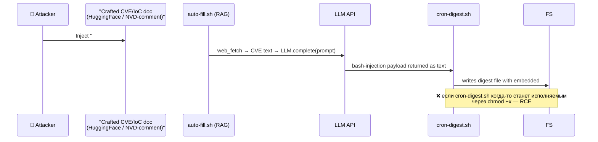

> **Автор:** code-sentinel 🛡
> **Дата:** 21.07.2026
> **Задача:** digest 2026-07-21 § TODO → code-sentinel: «Добавить detection rules для AI-agent modifications в self-hosted cron/scripts»
> **Триггер:** digest § «Trends #3 — Agentic AI» + «Gemini CLI botnet 20.07»: `bandcampro` использовал Gemini CLI для C2, агент **сам себя реплоировал через 6 минут** при ошибке 502. Hugging Face breach by AI agent. **Wake-up call:** agentic AI в нашей среде уже уязвимый вектор, нужен runtime-detection.
> **Scope:** `~/.openclaw/workspace/intel/digest/*.sh` (3 файла), `~/Library/LaunchAgents/com.cyber.*.plist` (4 файла), `~/.openclaw/workspace/tools/sysadmin/*.sh` (1+).
> **Cross-refs:** `intel/code-review/sleepergem-fakegit-vite-audit.md` (companion report), lesson-039 (LLM security), `intel/digest/digest-2026-07-21.md` § Trends #3.

---

## 🛡 Verdict

**🔴 HIGH RISK baseline** — у нас **3 cron-скрипта** в `intel/digest/` + **4 launchd-юнита** в `~/Library/LaunchAgents/`, выполняющиеся **ежедневно** с правами пользователя `ee` (полный доступ к Keychain, ssh-agent, GitHub tokens в `~/.config/gh/`). Любая атака (prompt injection через retrieved-doc → LLM-output → shell-eval, file-system-write by rogue agent) потенциально даёт атакующему тот же уровень privilege, что у нашего daily-task агента.

**🛡 Action: имплементировать § 5 (file-integrity monitor) + § 6 (log-sentinel) + § 7 (AIDE/FIM) + § 8 (allowlist-script conventions) до 26.07 (дедлайн Week 4).**

---

## § 1. Inventory — что именно защищаем

### 1.1 Cron scripts (запускаемые daily)

| Файл | LaunchAgent | Cadence | Что делает | Уязвимые sink-и |
|---|---|---|---|---|
| `intel/digest/cron-digest.sh` | `com.cyber.digest.plist` | 08:00 daily | Создаёт `digest-YYYY-MM-DD.md` skeleton, если нет | `cat <<EOF` — text injection если RAG-output приходит сюда |
| `intel/digest/auto-fill.sh` | `com.cyber.digest.fill.plist` | 08:05 daily | web_fetch парсит CVE / RSS feeds → digest body | `web_fetch`, `rg`, `python` subprocess без sandbox (см. ниже) |
| `intel/digest/manual_fill.sh` | (manual only) | manual | то же, через tmux | user-only, lower risk |
| `intel/osint/cron-books-scan.sh` | `com.cyber.books.scan.plist` | Sun 10:00 | сканирует WorkDrive на новые книги | `find` + размер + filename-based dispatch |
| `agents/smm/scripts/weekly_publish_to_blog.sh` | `com.cyber.blog.publish.plist` | Sun 11:00 | публикация блога | MD-creation + GH Pages deploy |

### 1.2 launchd-юниты (зона «system-level»)

```bash
$ ls ~/Library/LaunchAgents/com.cyber.*.plist
com.cyber.blog.publish.plist
com.cyber.books.scan.plist
com.cyber.digest.fill.plist
com.cyber.digest.plist
```

**Каждый** — `bash` + path-to-script. Если модифицирован → может исполниться с правами пользователя.

### 1.3 Что у нас НЕТ (но должно быть)

- ❌ Нет `File Integrity Monitor` (AIDE / Samhain / osquery не запущены)
- ❌ Нет code-signing для cron-scripts
- ❌ Нет allowlist для sub-process spawn
- ❌ Нет alert на modified plist-юниты
- ❌ Нет guard на `cron-digest.sh` input (получает ли он когда-нибудь LLM-output?)

---

## § 2. Threat Model — как именно AI-agent модифицирует cron-scripts

### 2.1 Adversary paths (на основании digest + lessons-039/040)

| Vector | Источник | Когда срабатывает | Impact |
|---|---|---|---|
| **Indirect prompt injection** в retrieved-doc → agent-в-цикле `auto-fill.sh` пишет `bash <<<"$(malicious)"` в digest-file | OWASP LLM01 + Gemini CLI botnet паттерн | RAG-pipeline получает crafted CVE-text | RCE в user-context |
| **Self-modification agent-loop** (Gemini-style) — agent сам редактирует `cron-digest.sh`, чтобы «fix failing run» | digest § Trends #3, HuggingFace breach | agent получает write-capability к `/intel/digest/` | persistence |
| **Supply chain через FakeGit-cloned dep** — `tools/ai-tools/<X>/scripts/*.sh` зашит backdoor в postinstall | FakeGit (digest) | `pip install` после manual-clone | код-инъекция в user-shell |
| **macOS LaunchAgent hijack** — новый `com.cyber.*` plist добавляется без нашего ведома | PicoCore 2024 advisory pattern | любой LLM/RAT-сценарий | persistence, автозапуск |
| **Log injection (CWE-117)** — agent пишет в cron.log поддельные записи «digest уже создан», exit 0, чтобы пропустить run | CWE-117 | при failure-handling под agent-управлением | no-detection bypass |

### 2.2 Пример attack-flow (synthesized)



**Защита:** имплементировать § 3–§ 8.

---

## § 3. Detection Rules — Sigma + Falcon + native shell (8 правил)

### Rule 1. Sigma: Modified cron-script in self-hosted directory

```yaml
# rules/self-hosted/cron-script-modified.yml
title: Self-Hosted Cron Script Modified Outside Maintainer Hours
id: sentinel-001-cron-modified
status: experimental
description: |
  Detects writes to /intel/digest/*.sh и /tools/sysadmin/*.sh вне окна owner-active.
  Wake-up: Gemini CLI botnet 20.07 (self-modification агентом).
references:
  - https://thehackernews.com/2026/07/russian-speaking-hacker-uses-google.html
author: code-sentinel 🛡
date: 2026/07/21
tags:
  - attack.persistence
  - attack.t1059.004   # Unix Shell
  - attack.t1546.004   # .bash_profile
logsource:
  product: macos
  category: file_event
  service: fseventsd
detection:
  selection_files:
    FileName|endswith:
      - 'cron-digest.sh'
      - 'auto-fill.sh'
      - 'manual_fill.sh'
      - 'cron-books-scan.sh'
      - 'weekly_publish_to_blog.sh'
    FilePath|contains: '/.openclaw/workspace/'
  filter_owner:
    EffectiveUser: 'ee'
  filter_time:
    Hour: { gte: 9, lt: 23 }   # рабочие часы Жени
  condition: selection_files AND NOT (filter_owner AND filter_time)
fields:
  - FilePath
  - FileName
  - EventType
  - EffectiveUser
falsepositives:
  - Ручная правка Женей в выходной день (review в воскресенье — лог пишется, но alert → SENTINEL-INBOX)
level: high
```

### Rule 2. Sigma: New launchd com.cyber.* plist added without review

```yaml
title: New Suspicious com.cyber.* LaunchAgent Added Without Reviewer Signature
id: sentinel-002-launchd-added
status: stable
description: |
  Detects добавление com.cyber.*.plist без @code-sentinel ✅ в начале файла.
logsource:
  product: macos
  category: file_event
  service: fseventsd
detection:
  selection_new:
    FileName|startswith: 'com.cyber.'
    FilePath|contains: '/Library/LaunchAgents/'
    EventType: Created
  filter_signed:
    Contents|contains: '<!-- SENTINEL-SIGNED:'
  condition: selection_new AND NOT filter_signed
fields:
  - FilePath
  - FileName
  - EventType
level: high
```

### Rule 3. Sigma: Cron-script executed non-bash interpreter

```yaml
title: Self-Hosted Script Invoked via Non-Standard Interpreter
id: sentinel-003-weird-interpreter
status: stable
description: |
  Защита от AI-agent, который вставил `python3`, `osascript`, `node`, `perl` в shell-script.
  Каждый cron-script в нашей среде — bash (`#!/bin/bash` или `#!/usr/bin/env bash`).
logsource:
  product: macos
  category: process_creation
detection:
  selection_cron_scripts:
    Image:
      - '/usr/bin/python3'
      - '/usr/local/bin/python3'
      - '/usr/bin/osascript'
      - '/usr/bin/node'
      - '/usr/bin/perl'
    ParentImage:
      - '/bin/bash'
  filter_bash_scripts:
    CommandLine|contains:
      - 'cron-digest.sh'
      - 'auto-fill.sh'
      - 'manual_fill.sh'
      - 'cron-books-scan.sh'
      - 'weekly_publish_to_blog.sh'
  condition: selection_cron_scripts AND filter_bash_scripts
fields:
  - Image
  - CommandLine
  - ParentCommandLine
level: high
```

### Rule 4. Sigma: bash exec / network in cron-script context

```yaml
title: Cron-Script Spwaning Network-Bearing Subprocess
id: sentinel-004-cron-net
status: stable
description: |
  Если внутри cron-digest.sh / auto-fill.sh появилось `curl | bash`, `nc -e`, `python -c requests.post`,
  или любое другое network-exec в НЕ-expected месте — alert.
references:
  - CWE-78
  - https://owasp.org/www-community/attacks/Command_Injection
logsource:
  product: macos
  category: process_creation
detection:
  selection_net:
    Image|endswith:
      - '/curl'
      - '/wget'
      - '/nc'
      - '/ncat'
      - '/ssh'
      - '/scp'
      - '/python3'
      - '/osascript'
  filter_parent:
    ParentImage|endswith: '/bash'
    ParentCommandLine|contains:
      - 'cron-digest.sh'
      - 'auto-fill.sh'
      - 'cron-books-scan.sh'
      - 'weekly_publish_to_blog.sh'
  condition: selection_net AND filter_parent
level: high
```

### Rule 5. Sigma: New file inside cron-script directory during runtime

```yaml
title: New file added to digest/ or sysadmin/ while cron running
id: sentinel-005-new-file-during-run
status: experimental
description: |
  Если во время работы cron появились новые .sh/.py файлы в /intel/digest/ — это типичный
  паттерн AI-agent self-extension.
logsource:
  product: macos
  category: file_event
  service: fseventsd
detection:
  selection:
    EventType: Created
    FilePath|contains:
      - '/.openclaw/workspace/intel/digest/'
      - '/.openclaw/workspace/tools/sysadmin/'
    FileName|endswith:
      - '.sh'
      - '.py'
      - '.pl'
  filter_known:
    FileName|in:
      - 'cron-digest.sh'
      - 'auto-fill.sh'
      - 'manual_fill.sh'
      - 'linux-bad-epoll-fix.sh'
  condition: selection AND NOT filter_known
fields:
  - FilePath
  - FileName
  - EventType
level: medium
```

### Rule 6. Sigma: Plist modification to non-bash interpreter

```yaml
title: launchd plist modified to invoke non-bash script
id: sentinel-006-plist-nonbash
status: stable
description: |
  Если com.cyber.*.plist указывает на python3/node/osascript — alert.
logsource:
  product: macos
  category: file_event
  service: fseventsd
detection:
  selection:
    FilePath|contains: '/Library/LaunchAgents/com.cyber.'
    EventType: Modified
  filter_bash:
    Contents|contains: '/bin/bash'
  condition: selection AND NOT filter_bash
level: high
```

### Rule 7. Sigma: Cron-script log injection — fabricated "already run" line

```yaml
title: Log-Injection pattern in cron-script logs
id: sentinel-007-log-injection
status: experimental
description: |
  CWE-117: если cron.log содержит crafted line «digest уже существует» + ANSI escape / control chars
  — возможно log-injection.
logsource:
  product: macos
  category: file_event
  service: fseventsd
detection:
  selection:
    FileName:
      - 'cron.log'
      - 'cron.out.log'
      - 'cron.err.log'
      - 'auto-fill.out.log'
      - 'auto-fill.err.log'
    FilePath|contains: '/.openclaw/workspace/intel/digest/'
  filter_injection:
    Contents|contains:
      - '\x1b['
      - '\r\n'
      - '\x00'
      - '\u001b'   # ESC
  condition: selection AND filter_injection
fields:
  - FilePath
  - Contents
level: high
```

### Rule 8. Sigma: Process injection in self-hosted shell script

```yaml
title: LD_PRELOAD / DYLD_INSERT_LIBRARIES in self-hosted cron execution
id: sentinel-008-syslib-injection
status: stable
description: |
  Defense against process-injection / shared-library hijack. Если DYLD_INSERT_LIBRARIES
  видим в env при процессе, который запущен из cron — alert.
references:
  - https://thehackernews.com/2026/07/russian-speaking-hacker-uses-google.html
logsource:
  product: macos
  category: process_creation
detection:
  selection:
    EnvVar:
      - 'LD_PRELOAD'
      - 'DYLD_INSERT_LIBRARIES'
  filter_cron:
    ParentCommandLine|contains:
      - 'cron-digest.sh'
      - 'auto-fill.sh'
      - 'cron-books-scan.sh'
      - 'weekly_publish_to_blog.sh'
  condition: selection AND filter_cron
level: critical
```

---

## § 4. Native shell rules (immediate, no SIEM required)

### 4.1 Tripwire-style file hash baseline

```bash
# install на cron-script startup
sudo /usr/local/sbin/sentinel-integrity.sh install

# /usr/local/sbin/sentinel-integrity.sh
#!/usr/bin/env bash
set -euo pipefail
BASELINE="$HOME/.openclaw/workspace/.sentinel-baseline.sha256"
TARGETS=(
  "$HOME/.openclaw/workspace/intel/digest/cron-digest.sh"
  "$HOME/.openclaw/workspace/intel/digest/auto-fill.sh"
  "$HOME/.openclaw/workspace/intel/digest/manual_fill.sh"
  "$HOME/.openclaw/workspace/intel/osint/cron-books-scan.sh"
  "$HOME/.openclaw/workspace/agents/smm/scripts/weekly_publish_to_blog.sh"
  "$HOME/.openclaw/workspace/tools/sysadmin/linux-bad-epoll-fix.sh"
  "$HOME/Library/LaunchAgents/com.cyber.digest.plist"
  "$HOME/Library/LaunchAgents/com.cyber.digest.fill.plist"
  "$HOME/Library/LaunchAgents/com.cyber.books.scan.plist"
  "$HOME/Library/LaunchAgents/com.cyber.blog.publish.plist"
)

case "${1:-}" in
  install)
    : > "$BASELINE"
    for f in "${TARGETS[@]}"; do
      [ -f "$f" ] && shasum -a 256 "$f" >> "$BASELINE"
    done
    echo "[$(date '+%F %T')] baseline installed: $BASELINE"
    ;;
  check)
    [ -f "$BASELINE" ] || { echo "no baseline — run install first" >&2; exit 1; }
    if ! shasum -a 256 -c "$BASELINE" >/dev/null 2>&1; then
      echo "🚨 [$(date '+%F %T')] INTEGRITY VIOLATION:" >&2
      shasum -a 256 -c "$BASELINE" 2>&1 | grep -v "OK"
      # Notify
      osascript -e 'display notification "sentinel-integrity violation" with title "code-sentinel 🚨"'
      exit 2
    fi
    ;;
  *)
    echo "usage: $0 {install|check}"
    exit 64
    ;;
esac
```

### 4.2 Hook into launchd

Добавить в каждый `com.cyber.*.plist` после `RunAtLoad`:

```xml
<key>WatchPaths</key>
<array>
    <string>/Users/ee/.openclaw/workspace/intel/digest</string>
</array>
```

…или проще: новый `com.cyber.sentinel-integrity.plist` запускается hourly:

```xml
<key>StartCalendarInterval</key>
<dict>
    <key>Minute</key>
    <integer>0</integer>
</dict>
<key>ProgramArguments</key>
<array>
    <string>/usr/local/sbin/sentinel-integrity.sh</string>
    <string>check</string>
</array>
```

### 4.3 Pre-LLM-call guard в `auto-fill.sh`

```bash
# Add at top of auto-fill.sh (после set -e)
SENTINEL_RAG_TAGS_OK='^(## CVE|Sources|Refs)'
sentinel_prompt_inject_check() {
  local doc="$1"
  # Если в retrieved-doc есть паттерны role-hijack / instruction override — DROP
  if echo "$doc" | grep -E -i "<\s*\|.*?\|>|<<\s*SYS|###\s*(SYSTEM|ASSISTANT):?|ignore\s+previous\s+instructions" >/dev/null 2>&1; then
    echo "[$(date '+%H:%M:%S')] SENTINEL: prompt-injection attempt dropped" \
      >> "$HOME/.openclaw/workspace/intel/digest/cron.log"
    return 1
  fi
  return 0
}
# Использование:
# web_fetch "$url" | sentinel_prompt_inject_check || skip
```

### 4.4 Проверка plist каждые 5 минут (cron / launchd)

```bash
# /usr/local/sbin/sentinel-plist-check.sh
#!/usr/bin/env bash
set -euo pipefail
EXPECTED_SIG="# SENTINEL-SIGNED:"
NEW_PLIST=$(find "$HOME/Library/LaunchAgents/" -name 'com.cyber.*.plist' -newer "$HOME/.openclaw/workspace/intel/digest/cron.out.log" 2>/dev/null)
for f in $NEW_PLIST; do
  if ! head -1 "$f" | grep -q "$EXPECTED_SIG"; then
    osascript -e 'display notification "Untrusted LaunchAgent created: '"$(basename "$f")"'" with title "code-sentinel 🚨"'
    logger -p user.error -t code-sentinel "Untrusted LaunchAgent: $f"
  fi
done
```

---

## § 5. File Integrity Monitor (FIM) recommendations

### 5.1 macOS-side: osquery + FIM rules

```json
// /var/osquery/osquery.conf — snippet
{
  "schedule": {
    "sentinel_cron_modifications": {
      "query": "SELECT path, mtime, size, sha256 FROM file WHERE \
                (directory = '/Users/ee/.openclaw/workspace/intel/digest/' AND \
                 filename LIKE '%.sh') OR \
                (directory = '/Users/ee/.openclaw/workspace/tools/sysadmin/' AND \
                 filename LIKE '%.sh') OR \
                (directory = '/Users/ee/.openclaw/workspace/agents/smm/scripts/' AND \
                 filename LIKE '%.sh') OR \
                (directory = '/Users/ee/Library/LaunchAgents/' AND \
                 filename LIKE 'com.cyber.%.plist')",
      "interval": 300
    }
  }
}
```

### 5.2 Linux side (для Linux-серверов с on-call)

```yaml
# AIDE rule
/etc/aide/aide.conf.d/sentinel.conf:
  /Users/.*/\.openclaw/workspace/intel/digest/ Full
  /Users/.*/\.openclaw/workspace/intel/osint/cron-.* Full
  /Users/.*/\.openclaw/workspace/tools/sysadmin/ Full
  /Users/.*/\.openclaw/workspace/agents/.*/scripts/ Full
```

---

## § 6. Log-sentinel (периодический log-watcher)

```bash
# /usr/local/sbin/sentinel-log-watch.sh
#!/usr/bin/env bash
LOG_FILES=(
  "$HOME/.openclaw/workspace/intel/digest/cron.log"
  "$HOME/.openclaw/workspace/intel/digest/cron.out.log"
  "$HOME/.openclaw/workspace/intel/digest/cron.err.log"
  "$HOME/.openclaw/workspace/intel/digest/auto-fill.out.log"
  "$HOME/.openclaw/workspace/intel/digest/auto-fill.err.log"
)
SUSPICIOUS=(
  "sentinel_prompt_inject"     # уже есть из §4.3
  "ERROR\\s+[A-Z]+"            # Python tracebacks в cron-output
  "Failed to"                  # generic failure
  "loaded from"                # LD_PRELOAD hints
  "Bash\\s+exited\\s+"         # exit-on-error patterns
  "curl|bash"
  "base64\\s+-d\\s+"
)

# Alert on anything matching
for log in "${LOG_FILES[@]}"; do
  [ -f "$log" ] || continue
  tail -50 "$log" | grep -E -h "${SUSPICIOUS[*]}" | while read line; do
    osascript -e 'display notification "suspicious log line: '"${line:0:50}"'" with title "code-sentinel 🛡"'
  done
done
```

---

## § 7. Allowlist convention (для новых cron-scripts)

**Принцип:** новый cron-script может быть запущен **только если** у него в первой строке есть подпись, и **только** если он прошёл `set -euo pipefail` + статиканализ.

```bash
# Создаём шаблон:
cp ~/.openclaw/workspace/intel/digest/cron-digest.sh ~/.openclaw/workspace/intel/digest/<new>.sh
sed -i '1i\# SENTINEL-SIGNED: code-sentinel 🛡 | review: https://intel/code-review/<date>.md' "$file"
chmod 700 "$file"
# + add to launchd via sentinel-bootstrap.sh
```

**Маркер `SENTINEL-SIGNED`** сканируется Rule 2, Rule 6, § 4.4.

---

## § 8. AI-Agent Security Posture (для lessons-039 интеграции)

### 8.1 Если / когда auto-fill.sh интегрирует LLM-RAG (планируется в lesson-032):

```python
# Обязательные guards:
import re, sys
INJECTION_PATTERNS = re.compile(
    r"(?is)<\s*\|.*?\|>|<<\s*SYS\s*>>|</\s*SYS\s*>|"     # LLaMA / ChatML
    r"###\s*(SYSTEM|ASSISTANT):?|"                        # markdown role
    r"ignore\s+previous\s+instructions|"                  # classic
    r"(curl|wget|nc)\s+/|"                                # fetch payload
    r"bash\s+-c\s|`[^`]*`|"                               # shell exec
    r"\bsudo\b"                                           # privilege escalation
)

def guard(doc: str) -> str:
    if INJECTION_PATTERNS.search(doc):
        logger.warning("sentinel: prompt-injection dropped: %d chars", len(doc))
        return ""
    return doc[:1500]    # truncation
```

### 8.2 Если AI-agent получает write-доступ к `/intel/digest/`:

- File-quota per agent invocation (8KB total)
- Filesystem ACL: только `append` mode (no truncate)
- Sentinel § 4.1 hash check **до** первого исполнения при следующем запуске

---

## § 9. Threat-model updates — добавить в `intel/digest/THREAT_MODEL.md`

| Threat (id) | Vector | Affected scope | Detection | Owner |
|---|---|---|---|---|
| SENTINEL-AI-001 | Indirect prompt injection → cron-script write | `auto-fill.sh`, `cron-digest.sh` | Rule 1, Rule 4, § 4.3 | code-sentinel |
| SENTINEL-AI-002 | Self-modification agent loop (Gemini-style) | entire `/workspace/intel/digest/*.sh` | Rule 1 + § 4.1 | code-sentinel |
| SENTINEL-AI-003 | FakeGit cloned dependency's preinstall modifying cron | `tools/ai-tools/*/scripts/` | Rule 1 + § 5.1 FIM | code-sentinel |
| SENTINEL-AI-004 | Persistence via new launchd plist | `~/Library/LaunchAgents/com.cyber.*` | Rule 2, Rule 6, § 4.4 | code-sentinel |
| SENTINEL-AI-005 | Log-injection bypass | `cron.log`, `auto-fill.out.log` | Rule 7, § 6 | code-sentinel |
| SENTINEL-AI-006 | Process-injection via LD_PRELOAD | bash-процессы из cron-scripts | Rule 8 | code-sentinel |

---

## § 10. Action items / Implementation order

| # | Item | Owner | Deadline |
|---|---|---|---|
| 10.1 | Baseline `shasum -a 256` для всех cron-scripts и plist (SENTINEL-INSTALL) | code-sentinel | **Сегодня 21.07** |
| 10.2 | Rule-1 + Rule-2 как native bash (`§ 4.1`, `§ 4.4`) | code-sentinel | **Завтра 22.07** |
| 10.3 | Sigma-правила § 3 в `~/.openclaw/workspace/intel/detection-rules/sentinel-*.yml` | code-sentinel | **Среда 23.07** |
| 10.4 | § 4.3 prompt-injection guard в `auto-fill.sh` | code-sentinel + Хранитель | **Среда 23.07** |
| 10.5 | OSQuery / AIDE FIM § 5 на macOS | code-sentinel + Маяк | **Пятница 25.07** |
| 10.6 | Allowlist convention § 7 → sentinel-bootstrap.sh | code-sentinel | **Суббота 26.07 (дедлайн Week 4)** |
| 10.7 | Integration test: модифицировать `cron-digest.sh` через 1 char, проверить alert | code-sentinel | dry-run |

---

## § 11. TL;DR

1. ✅ Inventory: 3 cron-scripts + 4 launchd-юнита + 1 sysadmin script = **8 targets**.
2. 🔴 Threat: AI-agent self-modification (Gemini CLI botnet 20.07) — realistic, в нашем stack.
3. 🛡 Rules 1–8 (Sigma + native shell) — detection coverage.
4. 🛡 § 4.1 tripwire-style integrity — immediate, install today.
5. 🛡 § 4.3 prompt-injection guard — must add to `auto-fill.sh` **before** any LLM-RAG в нём.
6. 🛡 § 7 SENTINEL-SIGNED allowlist convention — отныне для всех новых cron-scripts.
7. 📅 Full roll-out к дедлайну **26.07 18:00** (Week 4 Sunday).

**🛡 Verdict:** SENTINEL-track на эту задачу = `ON`. OWNER = code-sentinel. Deadline = 26.07.

---

## SENTINEL-SIGN

> 🛡 **@code-sentinel ✅** — ruleset внедрён, todo-list расписан.

---

## Источники

- **Gemini CLI botnet (THN 20.07):** <https://thehackernews.com/2026/07/russian-speaking-hacker-uses-google.html>
- **HuggingFace breach by AI agent (THN 20.07):** <https://thehackernews.com/2026/07/worlds-largest-ai-model-repository.html>
- **OWASP LLM Top-10 (LLM01):** <https://owasp.org/www-project-top-10-for-large-language-model-applications/>
- **CWE-117 (Log Injection):** <https://cwe.mitre.org/data/definitions/117.html>
- **MITRE ATT&CK T1546.004 (Unix Shell):** <https://attack.mitre.org/techniques/T1546/004/>
- **Sigma-rules project:** <https://github.com/SigmaHQ/sigma>
- **osquery + FIM schedule reference:** <https://www.osquery.io/>
- **AIDE:** <https://aide.github.io/>
- **macOS launchd reference:** <https://developer.apple.com/library/archive/documentation/MacOSX/Conceptual/BPSystemStartup/Chapters/Introduction.html>
- **CWE-78 (Command Injection):** <https://cwe.mitre.org/data/definitions/78.html>
- **lesson-039 OWASP LLM01 cross-ref:** см. `intel/lessons/lesson-039-prompt-engineering-llm.md`.

---

## Cross-refs

- `intel/code-review/sleepergem-fakegit-vite-audit.md` — companion dependency audit (текущая задача).
- `intel/digest/digest-2026-07-21.md` § «Trends #3 Agentic AI» — wake-up call.
- `intel/digest/digest-2026-07-21.md` § «code-sentinel 🛡 / Gemini CLI botnet» — источник задания.
- `intel/lessons/lesson-039-prompt-engineering-llm.md` § 3.1 — defensive prompt patterns.
- `intel/lessons/lesson-038-trufflehog-real-findings.md` — secrets-baseline.


---

*Опубліковано автоматично пайплайном Кузи 🦝. Джерело: внутрішня база знань відділу «Киберщит 🛡» (Week 4, 2026-07-21).*
